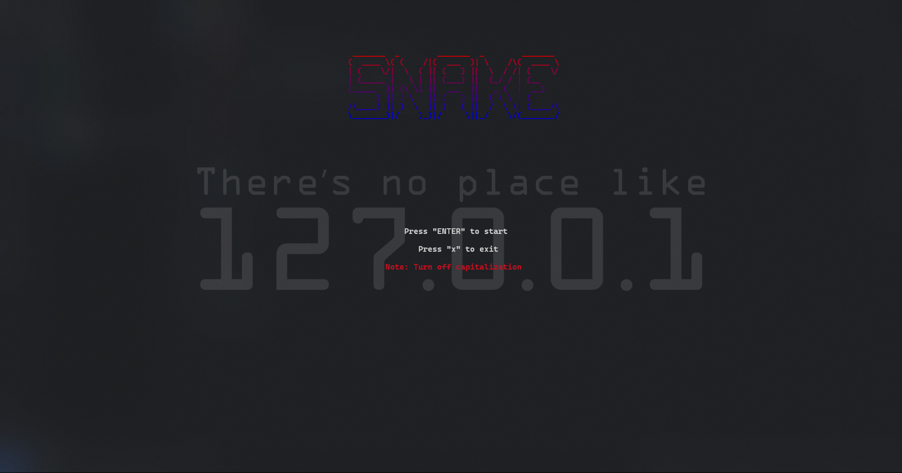

<h1 align=center><b>Snake</b></h1>
<div align=center>
    
    
</div>

</br>

## 简介
<div align=center>
    
</div>

<h5 align=center>普通的贪吃蛇游戏， C语言实现</h5>

</br>

## 编译

</br>

```shell
cd Snake
make
```

</br>

## 运行

</br>

```shell
.\snake.exe
```
